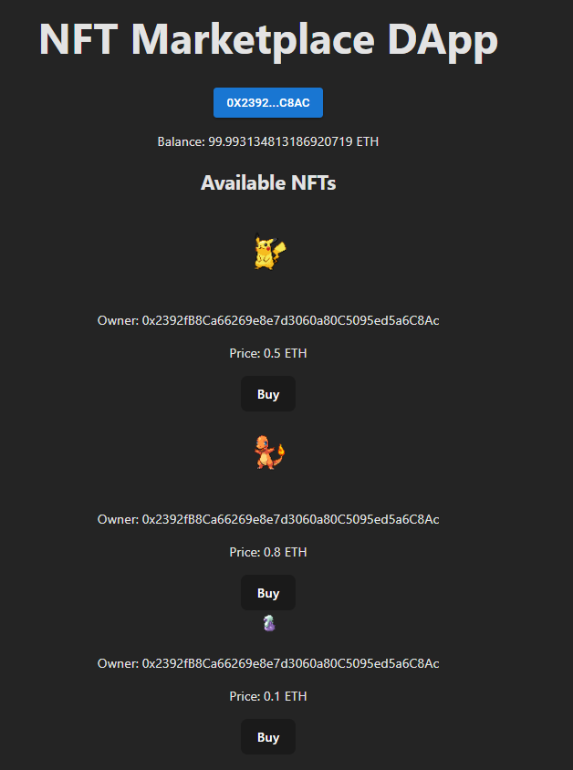

# Project: Blockchain Smart Contracts & DApp Implementation

## Check it live: https://brianmontero18.github.io/dapp-nft-marketplace/

This project includes the development, deployment, and testing of several Ethereum-based smart contracts and a decentralized application (DApp) frontend. The project is divided into four main phases, with each phase building on the previous ones to create a complete solution that integrates ERC-20 tokens, NFTs (ERC-721 and ERC-1155), and an NFT marketplace with custom functionalities. Additionally, a DApp interface was implemented to interact with these smart contracts.

## Smart Contracts Overview

This project consists of several smart contracts, each tailored for specific functionalities. Below is a brief overview of each contract, the primary functions, and the OpenZeppelin libraries utilized to enhance security and reliability.

### RewardToken (ERC-20 Token)

- **Purpose**: Acts as the main currency for transactions within the ecosystem.
- **Main Functions**:
  - `transfer`, `approve`, `transferFrom`: Standard ERC-20 functions enabling secure token transfers.
  - `mint`: Allows authorized addresses to mint new tokens to increase supply.
- **Libraries Used**: Implements OpenZeppelin’s `ERC20` standard to ensure security and compatibility.

### MyERC721Collection (ERC-721 Pokémon NFTs)

- **Purpose**: Creates unique, collectible NFTs representing Pokémon.
- **Main Functions**:
  - `mint`: Mints a new NFT with a unique ID to the specified address.
  - `setTokenURI`: Updates metadata (like images and descriptions) for each token ID, accessible to admin only.
- **Libraries Used**: Leverages OpenZeppelin’s `ERC721`, `Ownable`, and `AccessControl` to manage minting and metadata.

### MyERC1155Collection (ERC-1155 Items NFTs)

- **Purpose**: Allows batch minting of items (e.g., Pokéballs and Potions) with unique and reusable metadata.
- **Main Functions**:
  - `mint`: Mints multiple units of a given item type.
  - `setTokenURI`: Sets metadata URIs for each item type, restricted to admin.
- **Libraries Used**: Built on OpenZeppelin’s `ERC1155`, `Ownable`, and `AccessControl` for batch minting and metadata management.

### NFTStaking

- **Purpose**: Allows users to stake NFTs to earn reward tokens over time.
- **Main Functions**:
  - `stake`, `unstake`: Enables users to lock their NFTs and earn rewards.
  - `claimRewards`: Calculates and transfers accumulated rewards to the user based on staking duration.
- **Libraries Used**: Utilizes OpenZeppelin’s `Ownable` to control access and permissions.

### NFTMarketplace

- **Purpose**: Provides a platform for users to buy and sell NFTs (ERC-721 and ERC-1155) using the RewardToken.
- **Main Functions**:
  - `listERC721ForSale`, `listERC1155ForSale`: Lists an NFT for sale with a specified price and quantity (for ERC-1155).
  - `buyERC721`, `buyERC1155`: Allows users to purchase listed NFTs directly with RewardTokens.
- **Libraries Used**: Uses OpenZeppelin’s `Ownable` for ownership control and `IERC165` for interface detection.

### CollectionManager

- **Purpose**: Acts as the primary interface, managing interactions between the NFT collections, marketplace, and staking contracts.
- **Main Functions**:
  - `listForSale`: Simplifies listing operations for both ERC-721 and ERC-1155 NFTs.
  - `stakeNFT`, `claimRewards`: Facilitates staking and reward claiming through the staking contract.
  - `swapERC721`, `swapERC1155`: Allows for swapping assets between users with proper role-based permissions.
- **Libraries Used**: Leverages OpenZeppelin’s `AccessControl` for role management and `Pausable` to halt contract operations if necessary.

## Frontend DApp Integration

A DApp was created to interact with the deployed smart contracts. The DApp connects to the blockchain, allowing users to buy, sell, and view NFTs, and participate in the ICO using the ERC-20 token.

## Deployment and Execution

The contracts were initially deployed on a private Ganache network for testing, and then on a public testnet for final verification and user access.

## Documentation & Links

### Deployed Contract Addresses & Verification Links

Each contract was deployed on the Sepolia testnet and verified on Etherscan:

- **RewardToken** - [0x531C8310796c8C3f68343a74c5dAe5b690dc5A83](https://sepolia.etherscan.io/address/0x531C8310796c8C3f68343a74c5dAe5b690dc5A83#code)
- **ERC721 Pokemon Collection** - [0x38B84DF32696c2775A019956865f1ED12177b838](https://sepolia.etherscan.io/address/0x38B84DF32696c2775A019956865f1ED12177b838#code)
- **ERC1155 Items Collection** - [0x0d9BeE89CAE4f087Af9d4F5f50a7384B062156Aa](https://sepolia.etherscan.io/address/0x0d9BeE89CAE4f087Af9d4F5f50a7384B062156Aa#code)
- **NFTStaking** - [0xADF85e5D083209631d4fE4f4920F6AD586CABaEB](https://sepolia.etherscan.io/address/0xADF85e5D083209631d4fE4f4920F6AD586CABaEB#code)
- **NFTMarketplace** - [0x2D19CEF3ec27133C862f6b51D11b7B52AdB97dC5](https://sepolia.etherscan.io/address/0x2D19CEF3ec27133C862f6b51D11b7B52AdB97dC5#code)
- **CollectionManager** - [0x811c806Bc4c19E7Bb3eF0a0cA818ab8c4A61D0A8](https://sepolia.etherscan.io/address/0x811c806Bc4c19E7Bb3eF0a0cA818ab8c4A61D0A8#code)

### Transaction Hashes for Key Operations

The main operations performed after deployment include minting NFTs, setting metadata, and transferring tokens:

- **Minted Pikachu for Deployer (ERC721 Token ID 1)**: [0x76158e21b29b5f19b4b49fd6b8ba94fd27950aca5cbb351a6c5aded51b49c0b2](https://sepolia.etherscan.io/tx/0x76158e21b29b5f19b4b49fd6b8ba94fd27950aca5cbb351a6c5aded51b49c0b2)
- **Set Pikachu Metadata URI**: [0xa991cb27de63a4a8f8769444eddf5f547a16e791acce07a74678d96690722b6f](https://sepolia.etherscan.io/tx/0xa991cb27de63a4a8f8769444eddf5f547a16e791acce07a74678d96690722b6f)
- **Minted 50 Pokéballs (ERC1155 Token ID 1)**: [0xb64f4a05cb8b681599849b8e2c8f64de6a27511203f3e4ae1b0b4c2af6fb86df](https://sepolia.etherscan.io/tx/0xb64f4a05cb8b681599849b8e2c8f64de6a27511203f3e4ae1b0b4c2af6fb86df)
- **Set Pokéball Metadata URI**: [0x6e206adef250525eadd372b3e22fd68ef04e100198fdc75183e993f4bead91d6](https://sepolia.etherscan.io/tx/0x6e206adef250525eadd372b3e22fd68ef04e100198fdc75183e993f4bead91d6)
- **Transferred Reward Tokens to Staking Contract**: [0x2d0c03ccba54ecc025d48ee649949b846f451ba19cae3fd1b3b788149603a84a](https://sepolia.etherscan.io/tx/0x2d0c03ccba54ecc025d48ee649949b846f451ba19cae3fd1b3b788149603a84a)
- **Listed Pikachu (ERC721 Token) for sale**: [0x35383fe8e1680e3a8395a94ab390daf64403c5a11f3284eaea28235a5f95b3d3](https://sepolia.etherscan.io/tx/0x35383fe8e1680e3a8395a94ab390daf64403c5a11f3284eaea28235a5f95b3d3)
- **Listed Charmander (ERC721 Token) for sale**: [0xe24bcaee6b8b2841b1157c424b58aa4b3f165ad35096108f9dc8b14ed7dfd314](https://sepolia.etherscan.io/tx/0xe24bcaee6b8b2841b1157c424b58aa4b3f165ad35096108f9dc8b14ed7dfd314)
- **Listed 10 Pokéballs (ERC1155 Token) for sale**: [0x6320e1e34281ac58a63eb3eb73c81c67a312bf16e1a70041d7ae69cc5502cbae](https://sepolia.etherscan.io/tx/0x6320e1e34281ac58a63eb3eb73c81c67a312bf16e1a70041d7ae69cc5502cbae)
